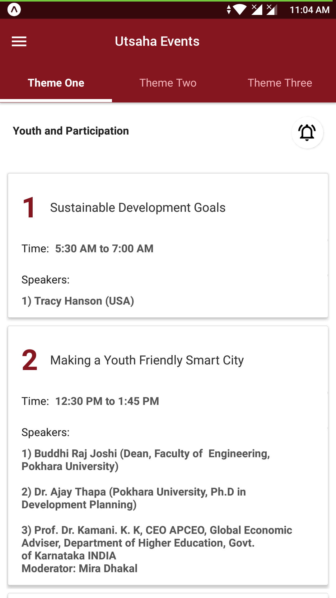
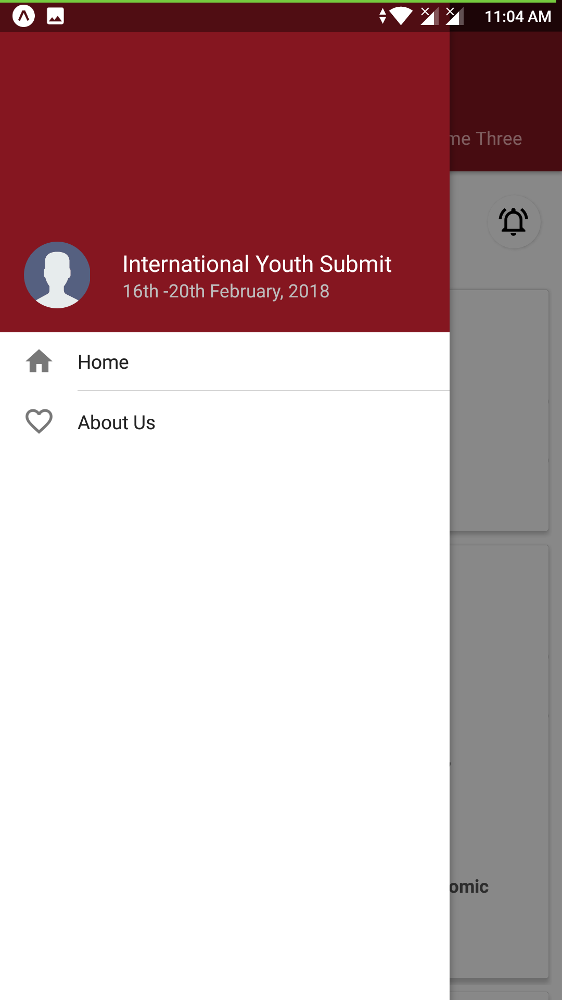
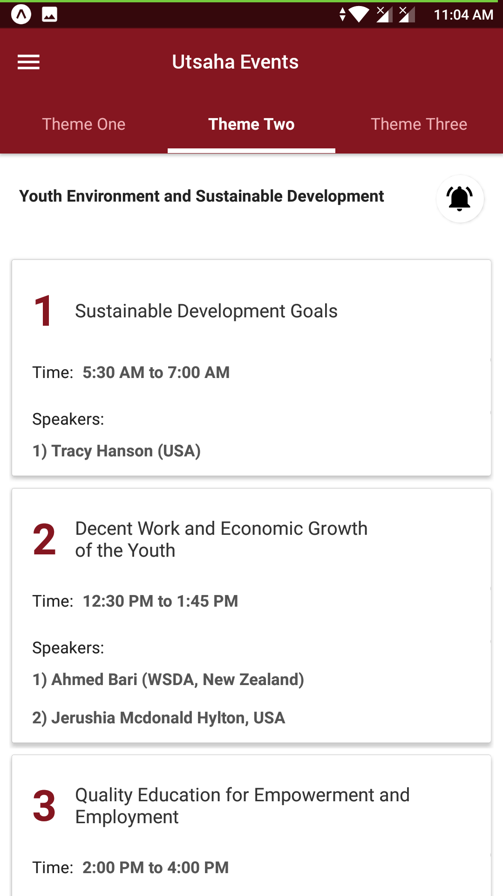
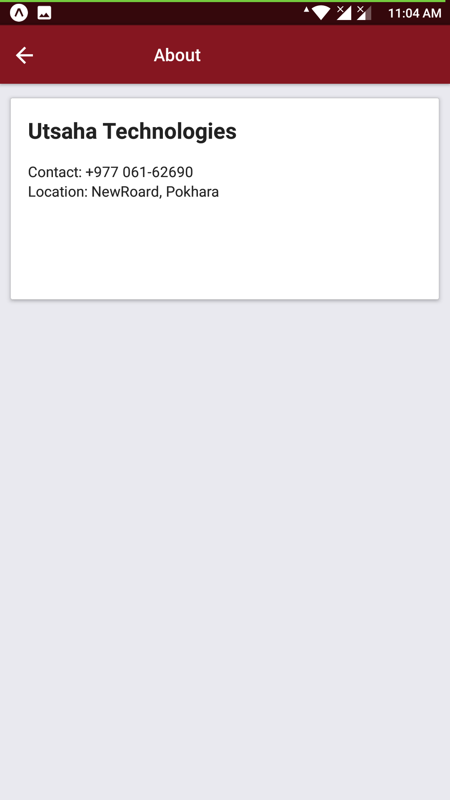

## Uthasaha Event Application

<b>Utsaha Event</b> is an event schedule spplication for "Global Youth Summit 2018 Nepal" held in Pokhara, Nepal.

Build with React Native (Expo).

### To Run the Project
```bash
yarn start
```

### Screenshots

|   	|   	|
|---	|---	|
|   	|   	|


